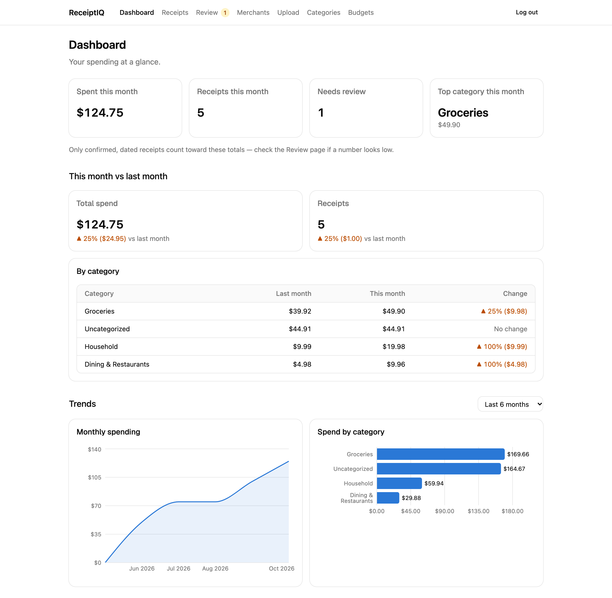
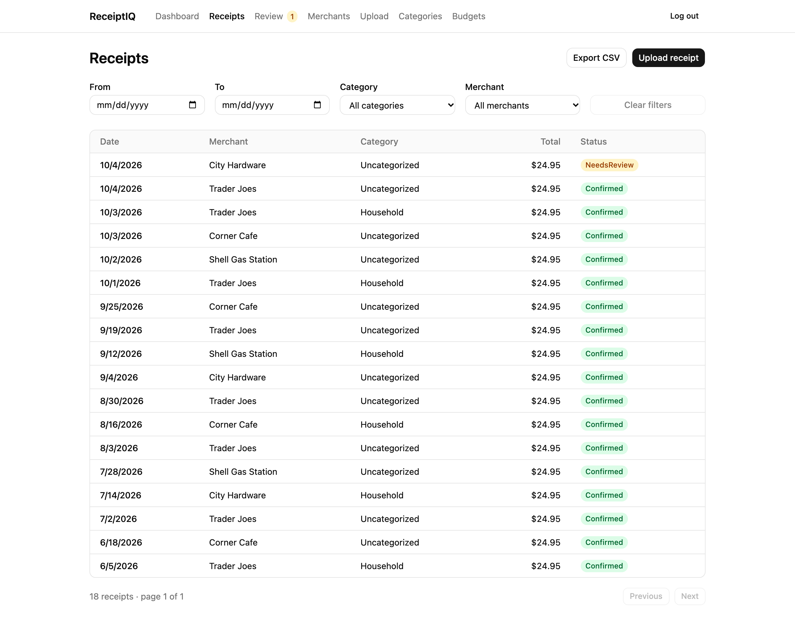
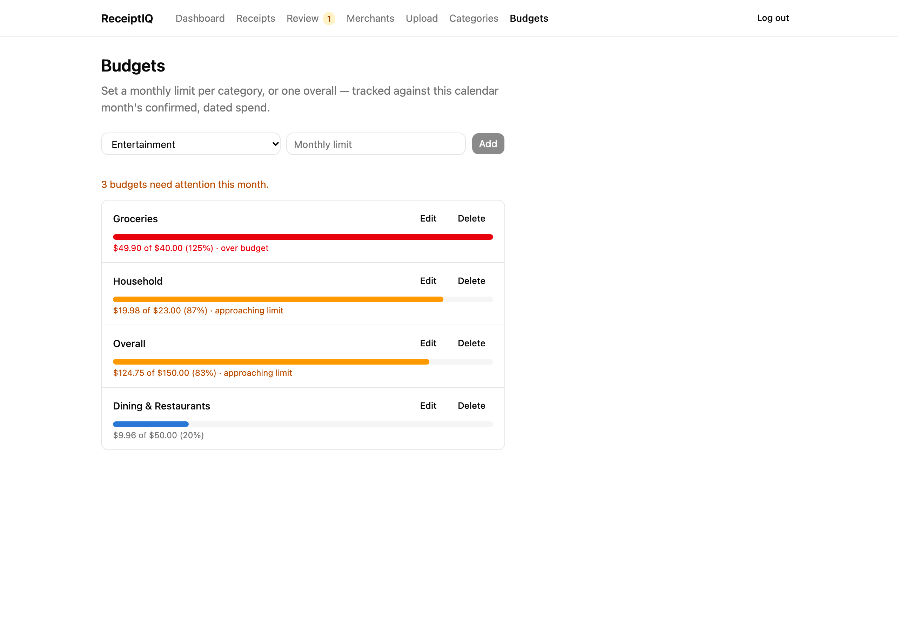
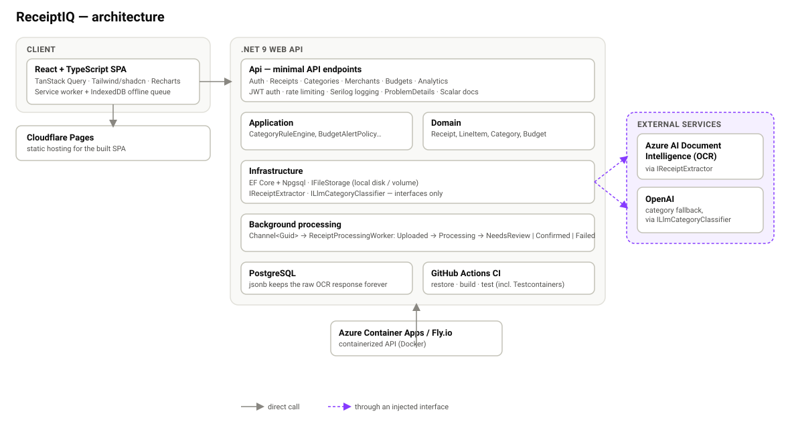

# ReceiptIQ

[](https://github.com/pkcprabash/receipt-iq/actions/workflows/ci.yml)

Personal expense tracker: photo/upload a receipt, extract the details with
OCR, categorize the line items, and see spending trends over time.

## Vision

Paper and PDF receipts pile up and nobody reads them again until tax season
or a budgeting panic. ReceiptIQ turns a photo of a receipt into structured,
queryable data automatically:

1. **Capture** — upload or photograph a receipt, even offline (it queues
   and sends itself once you're back online).
2. **Extract** — Azure AI Document Intelligence pulls merchant, date, line
   items, and totals from the image.
3. **Categorize** — a rules engine (with an LLM fallback) assigns a category
   to each line item, not the receipt as a whole, since a single Target trip
   is groceries *and* household *and* maybe electronics.
4. **Understand** — dashboards show spend by category, by month, and by
   merchant, plus month-over-month deltas and budget alerts, so trends are
   visible without spreadsheet archaeology.

The raw OCR response is kept forever alongside the parsed data, so
extraction and categorization can be improved and backfilled later without
asking anyone to re-upload a receipt.

## Screenshots

| Dashboard | Receipts |
| --- | --- |
|  |  |

| Budgets |
| --- |
|  |

## Architecture



A few decisions this follows throughout:

- **Money is always `decimal(18,2)`, never `double`.**
- **Categories belong to line items, not receipts** — a receipt's displayed
  category is derived (the dominant one by spend among its items).
- **The raw OCR response is never discarded**, even after it's been parsed
  into domain fields, so extraction can be redone later.
- **`IReceiptExtractor` and `IFileStorage` are interfaces.** Azure Document
  Intelligence and local-disk storage are two implementations behind them —
  swapped out entirely in tests and local dev for a fake extractor and a
  temp-directory file store.

## Features

- Email/password auth (ASP.NET Core Identity + JWT)
- Receipt upload with size/MIME/magic-byte validation and SHA-256
  duplicate detection, processed asynchronously by a background worker
- OCR extraction (Azure AI Document Intelligence, with a fake extractor for
  local dev so the pipeline works without any Azure account)
- A rule-based category engine (merchant match → line-item keyword match),
  an OpenAI fallback for anything the rules miss, and a review queue for
  low-confidence extractions
- Receipt list, filtering, and detail view with the original image
- Dashboard: spend by category/month/merchant, month-over-month comparison,
  and category/trend charts
- Per-category and overall monthly budgets with threshold alerts
- CSV export of line items, honoring the same filters as the receipt list
- A PWA: installable, with an offline upload queue (IndexedDB) that sends
  queued receipts automatically once you're back online
- Structured logging (Serilog), a global exception handler returning
  `ProblemDetails`, rate limiting on uploads, and interactive API docs
  (Scalar) in development

## Stack

- **Backend:** .NET 9 Web API — `Api` / `Application` / `Domain` /
  `Infrastructure` projects
- **Database:** PostgreSQL + EF Core (`jsonb` for the raw OCR payload)
- **OCR:** Azure AI Document Intelligence, behind `IReceiptExtractor`
- **Frontend:** React + TypeScript + Vite, TanStack Query, Tailwind +
  shadcn/ui, Recharts, `vite-plugin-pwa`
- **Observability:** Serilog structured logging, ASP.NET Core rate limiting
- **Testing:** xUnit for unit tests; a real Postgres via Testcontainers +
  `WebApplicationFactory` for API integration tests
- **Local dev:** Docker Compose (Postgres + API + web)
- **CI/CD:** GitHub Actions → Azure Container Apps / Fly.io (API) +
  Cloudflare Pages (web)

## Repo layout

```
src/
  Api/             ASP.NET Core Web API (composition root, Dockerfile)
  Application/     Use cases, interfaces (IReceiptExtractor, IFileStorage)
  Domain/          Entities, value objects — no external dependencies
  Infrastructure/  EF Core, Azure Document Intelligence, file storage
tests/
  Domain.Tests/          Unit tests for domain logic
  Infrastructure.Tests/  Unit tests for Application/Infrastructure logic
  Api.Tests/              HTTP-level integration tests (Testcontainers)
web/               React + TypeScript SPA (Vite)
docker-compose.yml       Postgres only, for local dev against `dotnet run`
docker-compose.prod.yml  Postgres + the containerized API
```

## Getting started

Prerequisites: [.NET 9 SDK](https://dotnet.microsoft.com/download), Node 20+,
Docker.

```bash
# start Postgres
docker compose up -d postgres

# apply migrations (first run, and after pulling any migration changes)
dotnet ef database update --project src/Infrastructure --startup-project src/Api

# build and run the API
dotnet build ReceiptIQ.sln
dotnet run --project src/Api

# check it's wired up
curl http://localhost:5299/health
```

No Azure or OpenAI account is required for local dev: with
`DocumentIntelligence`/`OpenAiClassifier` left blank in
`appsettings.Development.json` (the default), the API uses a fake extractor
and a no-op classifier so the whole upload-to-dashboard pipeline works
end to end. In development, interactive API docs are at
`http://localhost:5299/scalar/v1`.

```bash
# frontend dev server (separate terminal)
cd web
cp .env.example .env.local   # first time only
npm install
npm run dev
```

The web app runs at `http://localhost:5173`.

## Running tests

```bash
# unit tests (Domain, Application/Infrastructure logic)
dotnet test tests/Domain.Tests
dotnet test tests/Infrastructure.Tests

# everything, including HTTP-level integration tests — these spin up a
# real Postgres via Testcontainers, so Docker must be running
dotnet test ReceiptIQ.sln
```

```bash
cd web
npm test
```

## Running in Docker

`src/Api/Dockerfile` is a multi-stage build producing a small, non-root
runtime image. `docker-compose.prod.yml` wires it up with Postgres:

```bash
cp .env.example .env   # fill in a real POSTGRES_PASSWORD and JWT_SIGNING_KEY
docker compose -f docker-compose.prod.yml up -d postgres

# first run only — the runtime image has no SDK/dotnet-ef, so migrations
# run from the host against the now-exposed Postgres port
ConnectionStrings__Postgres="Host=localhost;Port=5432;Database=receiptiq;Username=receiptiq;Password=$POSTGRES_PASSWORD" \
  dotnet ef database update --project src/Infrastructure --startup-project src/Api

docker compose -f docker-compose.prod.yml up --build
```

See the comments at the top of `docker-compose.prod.yml` for why migrations
run as a separate step rather than on every container start.

## Status

Upload, OCR extraction, categorization, and analytics are all built and
working end to end, along with the production-readiness pieces (logging,
rate limiting, containerization, integration tests, a PWA with offline
upload queueing). Deploying the API and web app to real infrastructure
(Azure Container Apps/Fly.io + Cloudflare Pages) is the remaining work.
